# AoC2022
My solutions for the Advent of Code 2022

### The Golden Giraffes

## My visualizations

### Day5
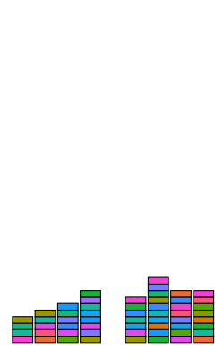

### Day6
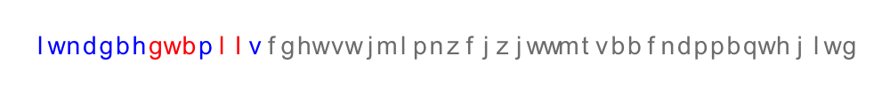

### Day8
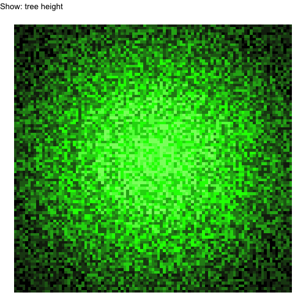

### Day9

### Day10

## AoC2022 story illustraed with AI generated images from DALL·E
[DALL·E](https://labs.openai.com/)

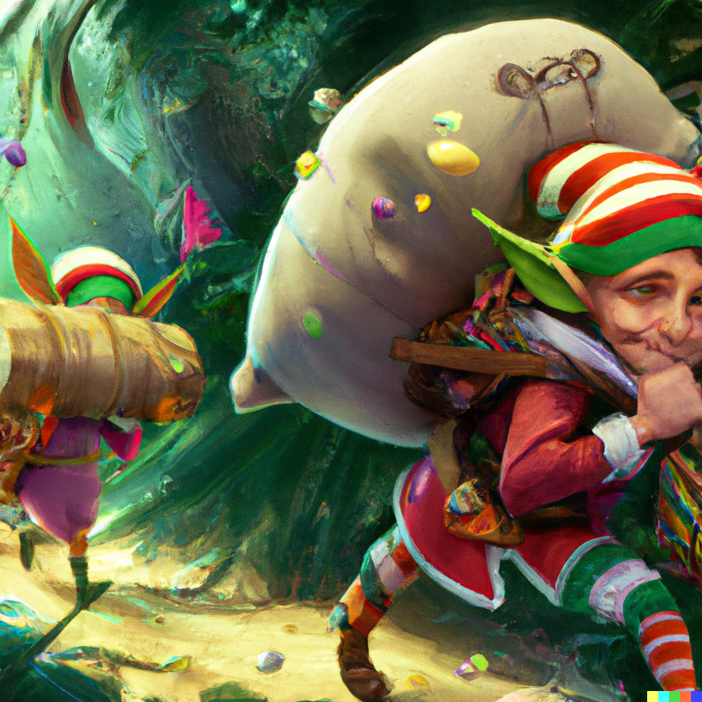 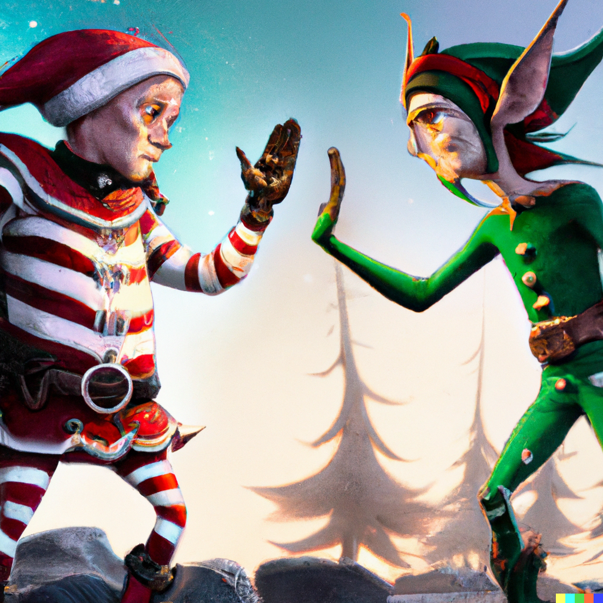 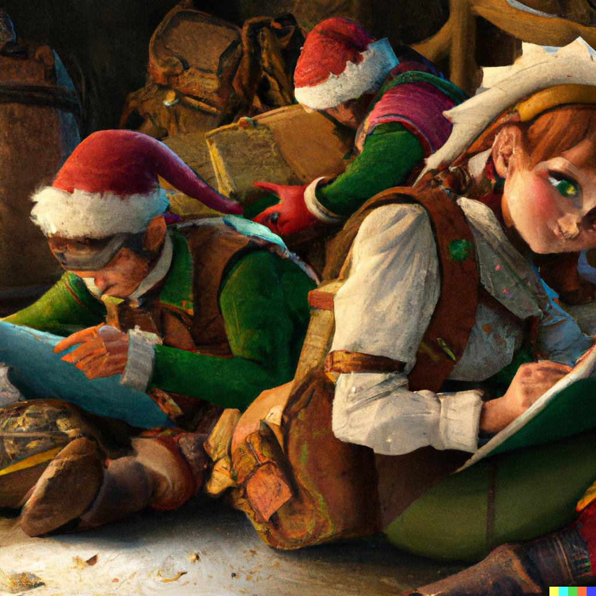 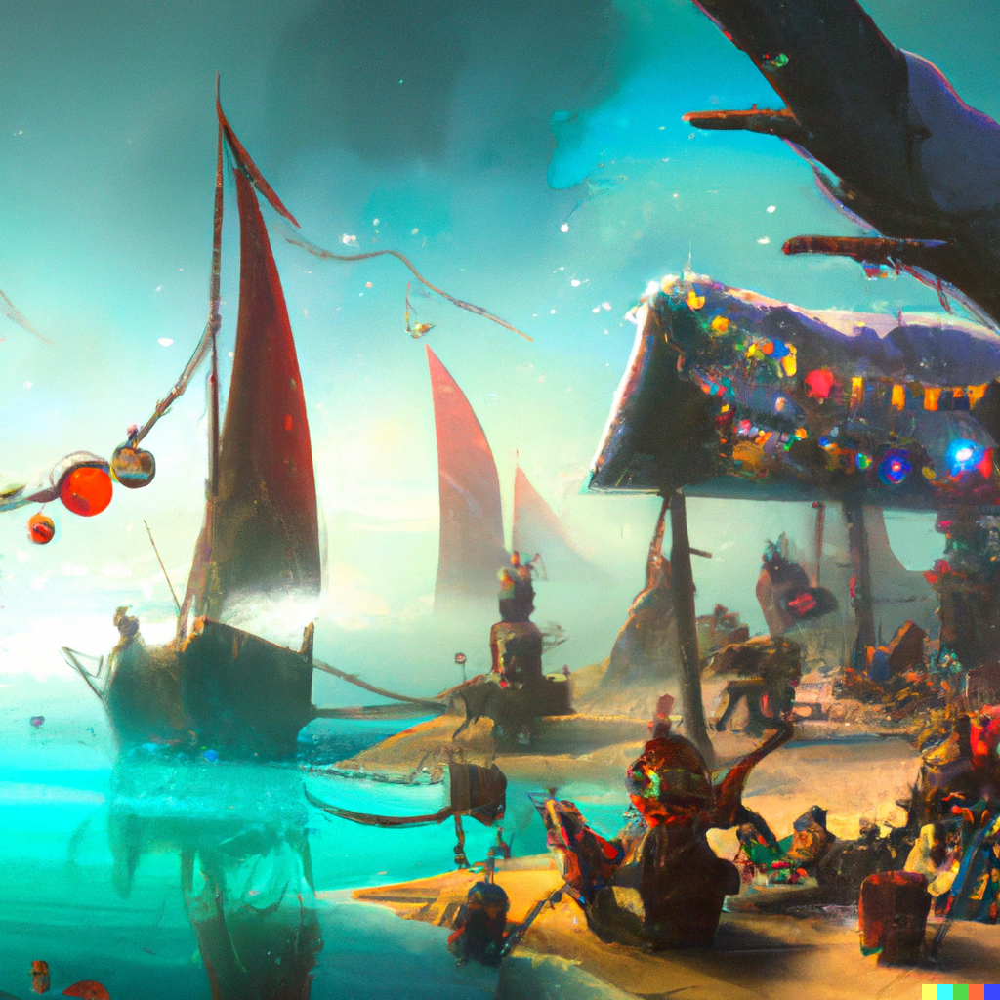 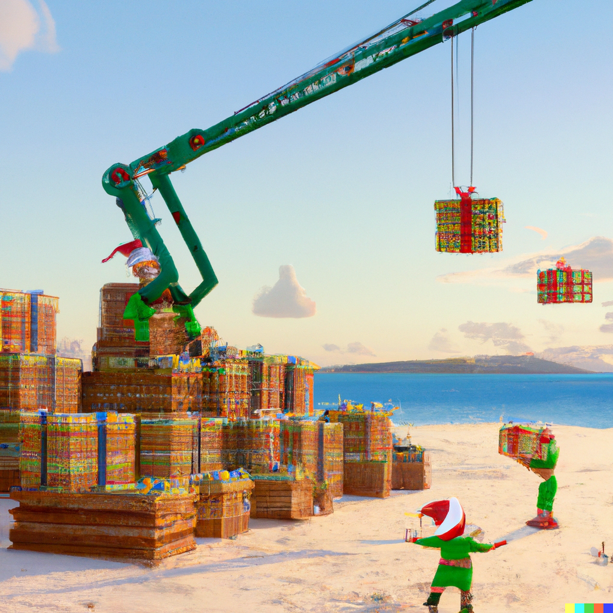 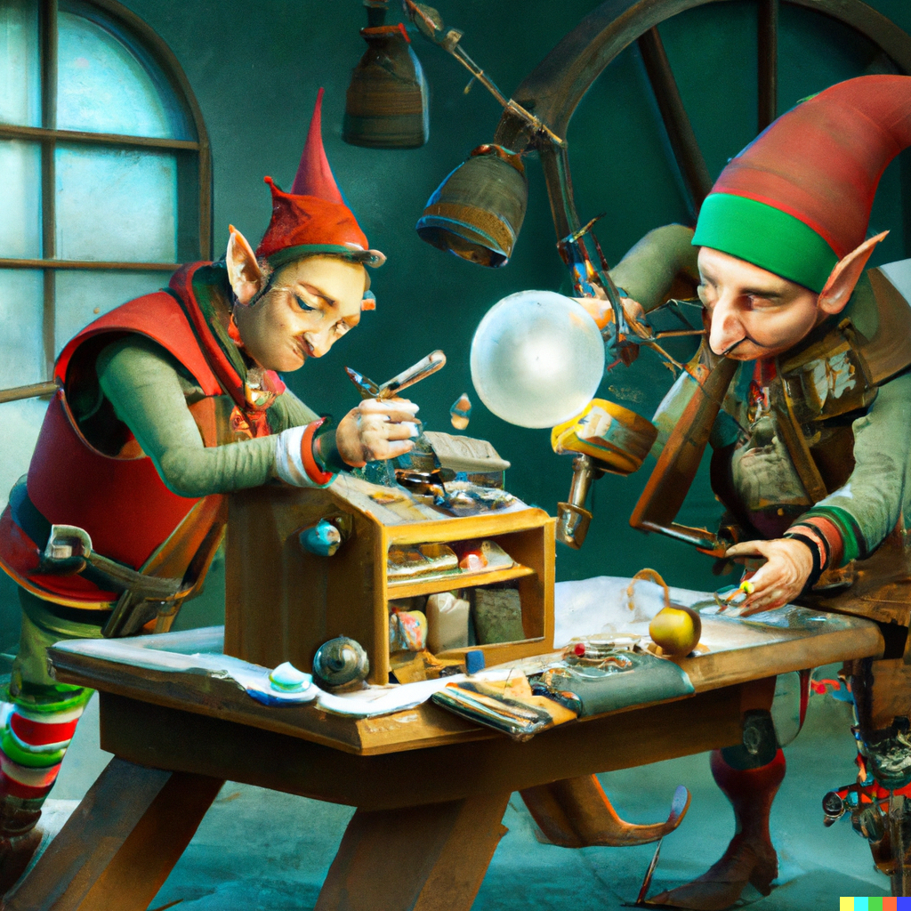 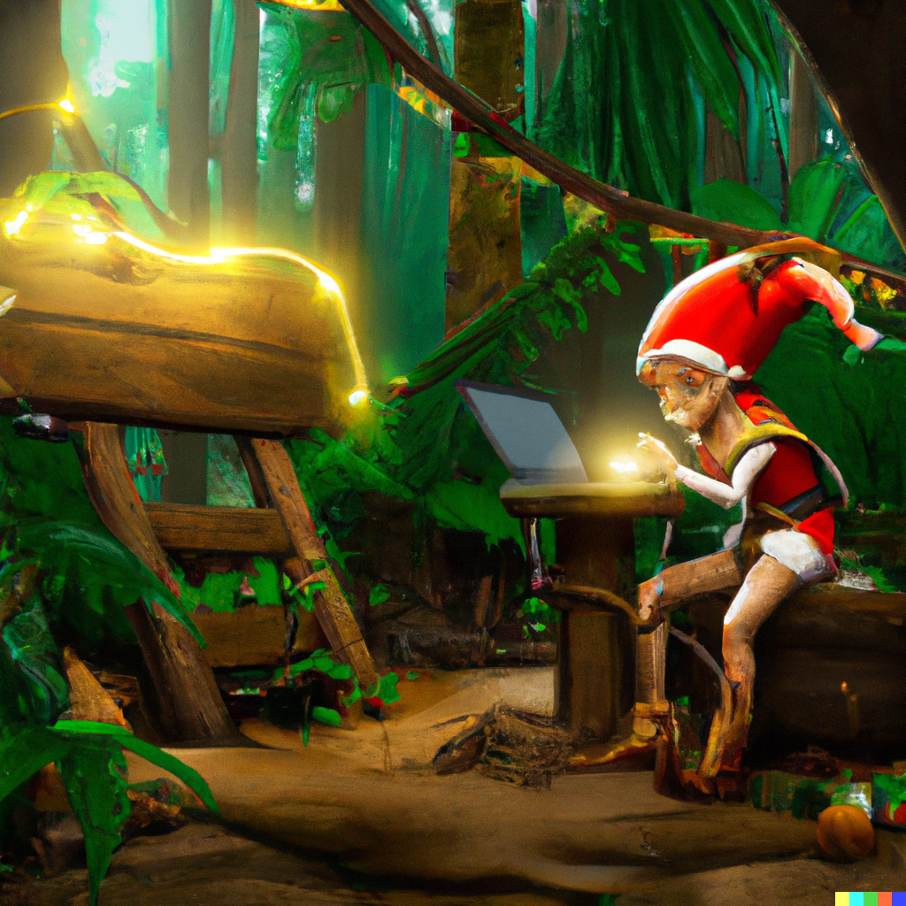 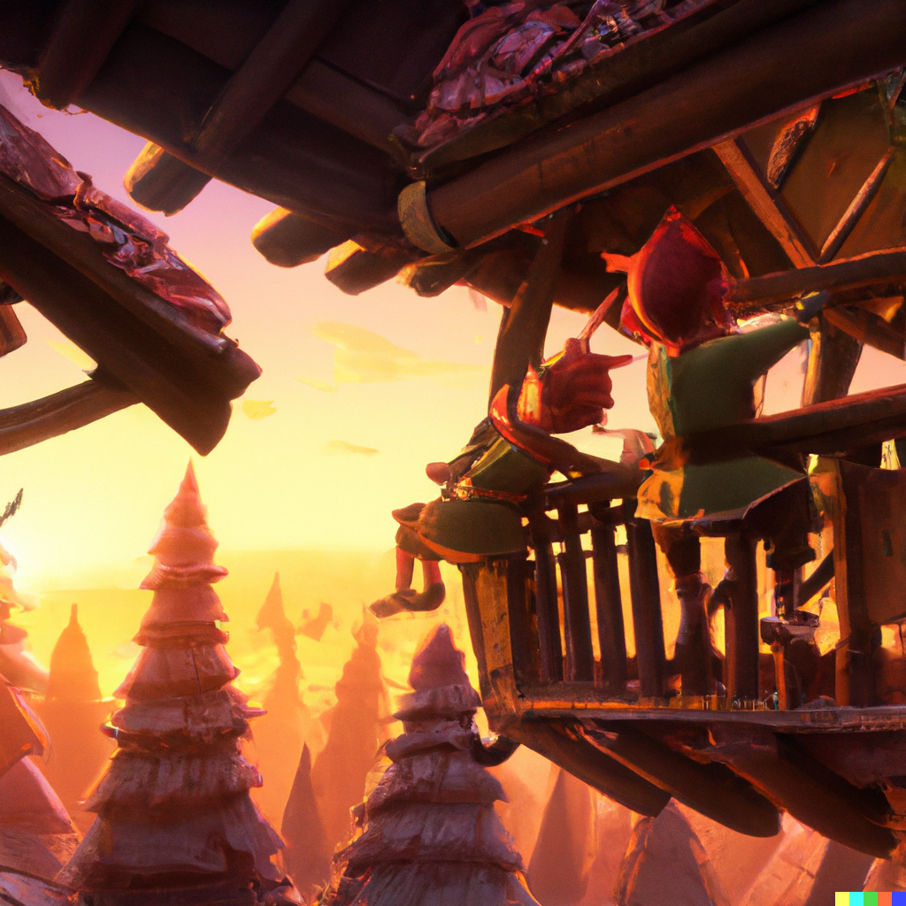 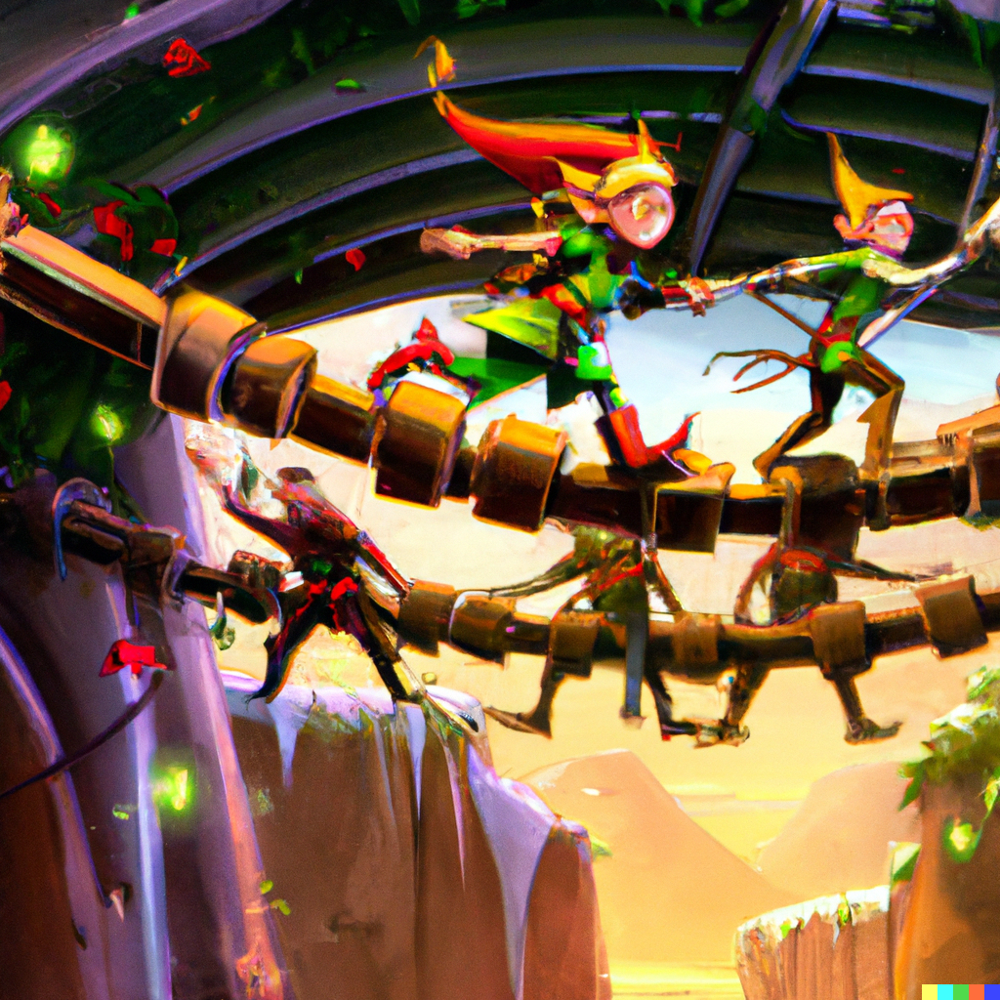 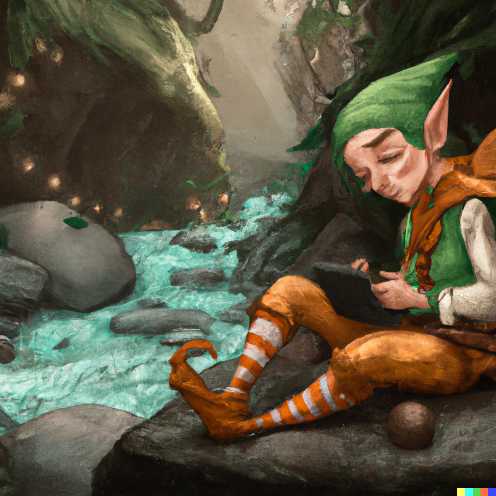

