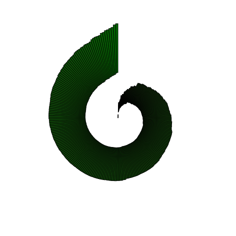
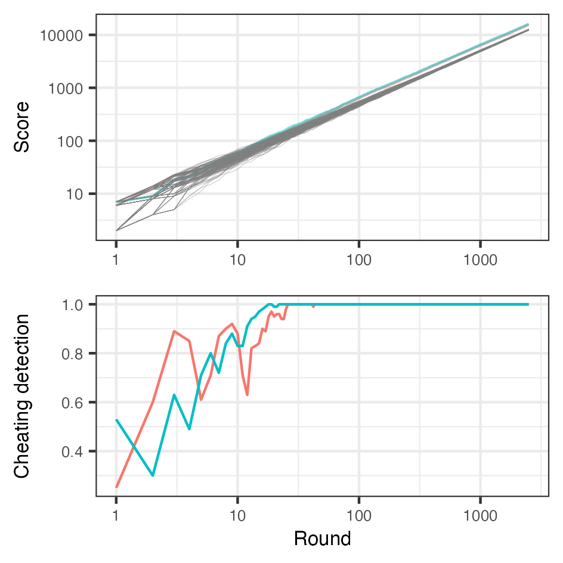

# AoC2022
My solutions for the Advent of Code 2022

### The Golden Giraffes

## AoC2022 story illustraed with AI generated images from DALL·E
[DALL·E](https://labs.openai.com/)

### Day 1

### Day 2

## My data visualizations:
### Day 1

### Day 2

